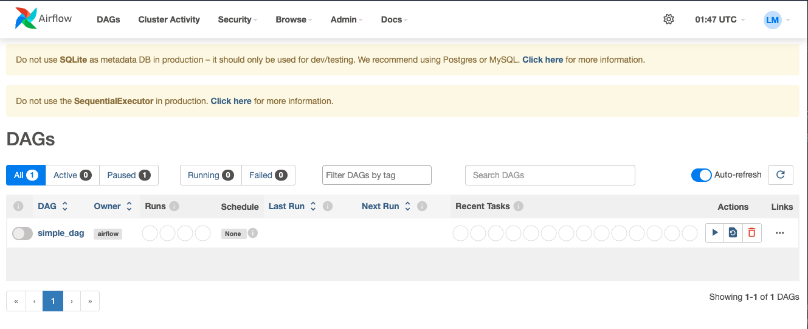

## Airflow 프로젝트 폴더 내 설치
* 유의: 본 프로젝트는 poetry를 통한 가상환경 셋업 및 패키지 관리를 진행하였지만, 아래 설명에는 poetry가 아닌 pip를 통한 패키지 설치 방법을 설명하였습니다. 

### 가상환경 설치
* poetry를 통해 python 가상환경, 패키지를 설정할 수 있습니다. 여러 프로젝트를 진행할 때, 각각에 요구되는 패키지를 독립적으로 관리할 수 있습니다.
* poetry 설치
    ```bash
  $ brew install poetry
    ```


### 1. Airflow 설치
#### 1.1. 환경변수 AIRFLOW_HOME 설정
* airflow documentation에서는 ```$AIRFLOW_HOME=~/airflow```로 권장하는데, 프로젝트마다 다른 에어플로우 환경이 관리되어야 하면 이 값을 변경할 수 있습니다.
    ```bash
  // 프로젝트 폴더 하위에 airflow 폴더 생성 후 지정
  $ export AIRFLOW_HOME=/Users/leomoon/projects/airflow_sample/airflow 
    ```

#### 1.2 Airflow 패키지 설치
```bash
$ pip install apache-airflow
```

#### 1.3 Airflow 초기화
```bash
$ airflow db init
// 프로젝트 폴더 내 airflow 폴더 내에 airflow.db, airflow.cfg 파일 생성 확인
```

#### 1.4 example DAG 삭제
```
// ./airflow/airflow.cfg 파일 내 아래 값 수정
load_examples = False
```

#### 1.5 DAG 폴더 생성
아래 두 방법 중 하나로 진행
##### 1.5.1 폴더 생성
```bash
// airflow 폴더 내에 dags 폴더 생성
$ mkdir ./airflow/dags
```

##### 1.5.2 airflow.cfg 파일 수정 - 이미 존재하는 dags 폴더의 위치로 설정
```
// ./airflow/airflow.cfg 파일 내 아래 값 수정 
dags_folder = /Users/leomoon/projects/airflow_sample/airflow/dags
```

#### 1.5 user 추가 및 권한 설정
```bash
$ airflow users create \
  --username admin \
  --firstname YOUR_FIRST_NAME \
  --lastname YOUR_LAST_NAME \
  --role Admin \
  --email your_email@example.com
  
  // 위 명령어 실행 후 패스워드 설정 진행
```

#### 1.6 Airflow 웹서버, 스케쥴러 실행
```bash
$ airflow webserver
$ airflow scheduler
```
* 둘 다 실행해야 에어플로우 서버 및 DAG가 정상 실행되고 스케쥴링이 가능합니다.
* 하지만 위 명령어로는 한 터미널 세션에서 한 명령어밖에 실행되지 않으므로, 아래 명령어로 Damon으로 실행하는 것을 권장합니다.
* Daemon으로 실행 (백그라운드 실행)
  ```bash
  // 명령어 뒤에 -D를 붙여서 실행
  $ airflow webserver -D
  $ airflow scheduler -D
  ```

* example DAG가 모두 제거된 상태로 Airflow 웹서버에 접속하면 아래와 같이 나타납니다.
  